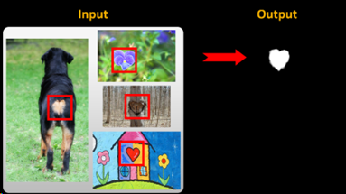
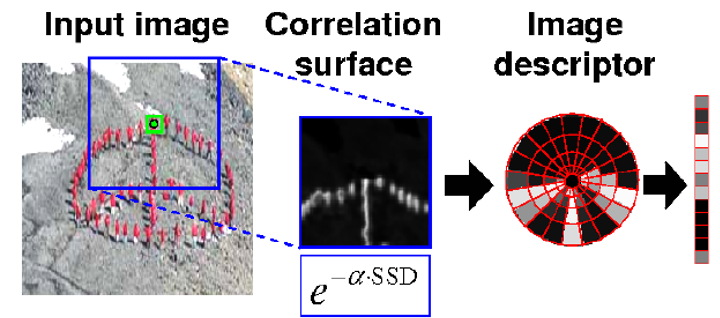

# Detect Common

1. 计算像素点的局部自相似描述子

- 对每个像素点，计算该点与以其为中心的图像区域内其他点的相似性。
- 进行对数极坐标变换，划分成多个小区域，并用每个小区域的最大值作为描述子的元素。
- 得到给定点的局部自相似性描述子。

  

### 2. 基于自相似性描述子的目标匹配

- 用矩形框遍历给定的第一张图像，假设有n个矩形框。
- 对每个矩形框图像区域，基于自相似描述子在其他每张图像中找到最匹配的区域。

### 3. 确定图像相同区域

- 从n个区域对中确定最有意义的目标区域对。
- 计算图像中与目标区域的最高匹配值。
- 计算统计显著性，选择最佳的包含公共区域的子图像。
